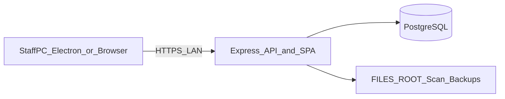

# Architecture

## Purpose

NSC-ERMS is a LAN-hosted **Employee Records Management System** for Northern Samar Colleges registrar workflows: employee records, 201 File documents, org structure, scan intake, users/RBAC, audit, and backups.

One **registrar server** runs API + SPA + PostgreSQL + file storage. Staff PCs use a browser or the Electron thin client against that server.

## System diagram



## Monorepo layout

npm workspaces at the repo root (`renderer`, `server`). Electron packages from the root.

| Path | Role |
|------|------|
| [`electron/`](../electron/) | Desktop main process, preload, Connect UI, icons |
| [`renderer/`](../renderer/) | Vanilla JS SPA (Vite); production build → `renderer/dist` |
| [`server/`](../server/) | Express API, services, DB tooling |
| [`db/migrations/`](../db/migrations/) | SQL schema source of truth |
| [`.env`](../.env.example) | Server config (loaded from project root) |

### Server layers

```text
server/src/
  index.js          HTTP/HTTPS listen
  app.js            Express composition, sessions, route mounts, static SPA
  config.js         Env + CORS + paths
  middleware/       auth, password gate, rate limit, errors
  routes/           HTTP adapters (/api/v1/*)
  services/         files, scan inbox, backup, audit, live SSE, settings
  db/               pool, migrate, seed
```

### Renderer layers

```text
renderer/src/
  main.js           App shell, hash routing, session restore, live sync
  js/api/           Thin fetch wrappers per resource
  js/components/    Pages / panels / modals
  js/utils/         authz, toast, liveSync, helpers
```

## Entry points

| Process | Entry | Notes |
|---------|-------|-------|
| API | [`server/src/index.js`](../server/src/index.js) | TLS or `ALLOW_HTTP_DEV` HTTP; default port **3443** |
| Express app | [`server/src/app.js`](../server/src/app.js) | Mounts `/api/v1/*`, serves SPA |
| SPA (dev) | Vite → [`renderer/index.html`](../renderer/index.html) → [`renderer/src/main.js`](../renderer/src/main.js) | Port 5173; proxies `/api` → `:3443` |
| SPA (prod) | Same origin as API | Express prefers `renderer/dist`, else `renderer/` |
| Electron | [`electron/main.js`](../electron/main.js) (`package.json` `"main"`) | Probes health, loads server URL |

## Why Electron is a thin client

Electron does **not** embed the Express server or talk to Postgres. It:

1. Resolves a `serverUrl` (env / `config.json` / default).
2. Probes `GET {serverUrl}/api/v1/health`.
3. Loads that origin in a `BrowserWindow`.

Session cookies work because the window is same-origin with the API. Business traffic is normal HTTPS `fetch` / SSE from the loaded SPA — not Electron IPC. See [electron-desktop.md](electron-desktop.md).

## API surface (mounts)

From [`server/src/app.js`](../server/src/app.js):

| Prefix | Router |
|--------|--------|
| `/api/v1/health` | `routes/health.js` |
| `/api/v1/setup` | `routes/setup.js` |
| `/api/v1/auth` | `routes/auth.js` |
| `/api/v1/lookups` | `routes/lookups.js` |
| `/api/v1/departments` | `routes/departments.js` |
| `/api/v1/positions` | `routes/positions.js` |
| `/api/v1/employees/:employeeId/documents` | `routes/documents.js` (`documentsRouter`) |
| `/api/v1/employees` | `routes/employees.js` |
| `/api/v1/documents` | `routes/documents.js` (`documentItemRouter`) |
| `/api/v1/scan-inbox` | `routes/scanInbox.js` |
| `/api/v1/backups` | `routes/backups.js` |
| `/api/v1/audit-logs` | `routes/audit.js` |
| `/api/v1/users` | `routes/users.js` |
| `/api/v1/events` | `routes/events.js` |

Full endpoint catalog: [api-reference.md](api-reference.md).

## Domain features (SPA pages)

**Records:** Employees, Departments, Positions, Scan Inbox, Trash (documents), Archived Employees  
**Tools:** Backup, Export  
**System:** Settings (appearance, password, users, audit)

Hash routes: `#employees`, `#departments`, `#positions`, `#scan-inbox`, `#trash`, `#archived-employees`, `#backup`, `#export`, `#settings`.

## Cross-cutting concerns

| Concern | Implementation |
|---------|----------------|
| Auth | Cookie session `nsc_erms.sid` (8h), Postgres `session` table |
| RBAC | Roles `viewer` / `staff` / `admin` / `superadmin` |
| Errors | `{ error: { code, message } }` via `HttpError` |
| Audit | `audit_logs` on sensitive actions (failures never fail the request) |
| Live sync | In-process SSE hub (`liveEvents.js`) — single Node process |
| IDs | ULID `CHAR(26)` |
| Files | Disk under `FILES_ROOT`; metadata in Postgres |

## Deploy model

- **Development:** `dev:server` + `dev:client` (+ optional `dev:desktop`).
- **Production server:** `npm run build` then `npm start`; TLS via env; keep process alive (NSSM, etc.). Details: [PRODUCTION_SETUP.md](../PRODUCTION_SETUP.md).
- **Desktop installer:** `npm run build:desktop` → `dist/desktop/` (Windows NSIS x64). UI updates ship with the **server** rebuild; reinstall Electron only when the shell changes.
