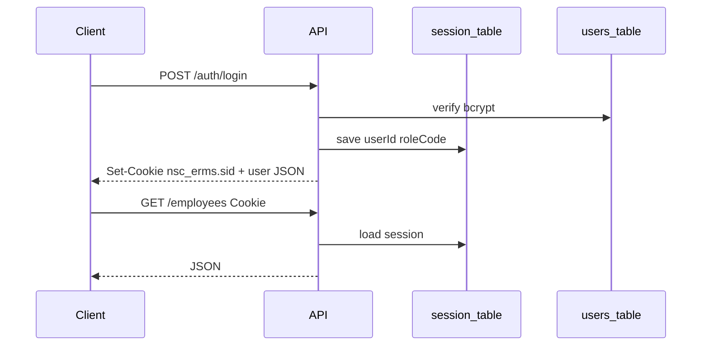

# Auth and RBAC

## Overview

NSC-ERMS uses **server-side sessions** stored in PostgreSQL (not JWTs). The SPA and Electron client rely on the browser cookie jar against the ERMS origin.



## Session configuration

From [`server/src/app.js`](../server/src/app.js):

| Setting | Value |
|---------|-------|
| Cookie name | `nsc_erms.sid` |
| Store | `connect-pg-simple` → table `session` |
| `httpOnly` | true |
| `sameSite` | `lax` |
| `secure` | true when TLS cert configured, or production without HTTP-dev |
| `maxAge` | 8 hours |
| Secret | `SESSION_SECRET` from `.env` |

`trust proxy` is enabled (`1`) for correct client IPs behind reverse proxies.

Production requires a strong `SESSION_SECRET` (length ≥ 32, not a known default). See [configuration.md](configuration.md).

## Login / logout / me

| Endpoint | Behavior |
|----------|----------|
| `POST /auth/login` | Normalize username lowercase; bcrypt compare; set `req.session.userId` + `roleCode`; update `last_login`; audit `auth.login` or `auth.login_failed` |
| `POST /auth/logout` | Audit `auth.logout`; `session.destroy`; clear cookie |
| `GET /auth/me` | Reload user + role; 401 if missing/inactive |
| `POST /auth/change-password` | Verify current password; hash new (cost 12); clear `must_change_password` |

Client restore on load: `me()` in [`renderer/src/main.js`](../renderer/src/main.js).

Passwords are never returned in API responses. UI prefs in `localStorage` do **not** store credentials.

## Rate limiting

[`middleware/rateLimit.js`](../server/src/middleware/rateLimit.js) — in-memory fixed windows (single process):

| Limiter | Window | Max | Key |
|---------|--------|-----|-----|
| Per account | 15 min | 5 | IP + username |
| Per IP | 15 min | 30 | IP |

Exceeding → `429` / `RATE_LIMITED`.

## Password change gate

[`middleware/passwordGate.js`](../server/src/middleware/passwordGate.js) runs on all `/api/v1` routes. If the session user has `must_change_password = true`, only these paths are allowed:

- `/api/v1/health`
- `/api/v1/setup/status`
- `/api/v1/auth/login`
- `/api/v1/auth/logout`
- `/api/v1/auth/me`
- `/api/v1/auth/change-password`

Everything else → `403` / `PASSWORD_CHANGE_REQUIRED`.

Seeded superadmin and admin password resets set `must_change_password = true` so the user must rotate before using the app.

## Middleware

[`middleware/auth.js`](../server/src/middleware/auth.js):

- **`requireAuth`** — session must have `userId`.
- **`requireRole(...codes)`** — loads active user's role from DB; sets `req.userRole`; rejects with `403 FORBIDDEN` if not in the list.

Route modules compose these explicitly (e.g. `writeRoles = requireRole('staff', 'admin', 'superadmin')`).

## Roles

Seeded in `user_roles` via [`seed.js`](../server/src/db/seed.js):

| Code | Write records | Manage users / backups / audit | Setup wizard |
|------|---------------|--------------------------------|--------------|
| `viewer` | no | no | no |
| `staff` | yes | no | no |
| `admin` | yes | yes (not superadmin accounts) | no |
| `superadmin` | yes | yes | yes (`POST /setup/complete`) |

### Server enforcement highlights

- Record mutations (employees, documents, departments, positions, scan assign/reject): staff+
- Users, backups, audit logs: admin+
- Creating/assigning/deleting/resetting **superadmin**: superadmin only
- Admin may assign only `admin` / `staff` / `viewer`
- Cannot deactivate/delete own account; cannot remove last active/last superadmin as applicable

### Client UI gating

[`renderer/src/js/utils/authz.js`](../renderer/src/js/utils/authz.js):

```js
canWrite()        // staff | admin | superadmin
canManageUsers()  // admin | superadmin
isSuperadmin()
```

Role is also mirrored on `document.body.dataset.role` for CSS/UI. **Client checks are UX only** — always enforce on the server.

## CSRF notes

SameSite=lax cookies reduce cross-site POST risk for classic cookie sessions. There is no separate CSRF token. Cross-origin SPA (Vite) needs CORS with `credentials: true` and an explicit allowlist in production (`CORS_ORIGINS`).

## Security middleware (related)

- **Helmet** enabled; CSP / COEP disabled for SPA compatibility (`app.js`).
- Login and sensitive actions write **audit_logs**.
- Electron locks navigation to the connected origin ([electron-desktop.md](electron-desktop.md)).
