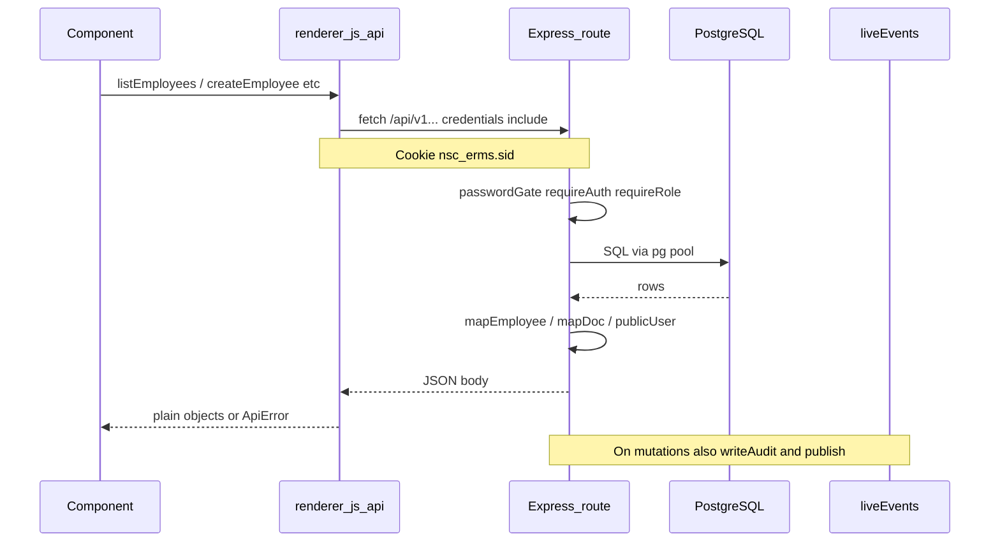
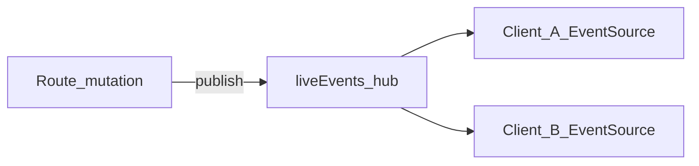

# Data flow

How data moves between the SPA, Express API, PostgreSQL, disk, and live clients.

## Happy path (JSON)



1. A UI component (e.g. `employeeTable.js`) calls a function in `renderer/src/js/api/*.js`.
2. Those modules use [`client.js`](../renderer/src/js/api/client.js) `api(path, options)`:
   - `fetch(`/api/v1${path}`, { credentials: 'include', ... })`
   - Default `Content-Type: application/json`
3. Express middleware runs globally first:
   - `passwordChangeGate` — blocks most APIs if `must_change_password`
   - Route-level `requireAuth` / `requireRole(...)`
4. Route handler runs SQL (and sometimes services for files/backup).
5. Response is shaped with a `map*` helper and sent as JSON.
6. On failure, [`errorHandler`](../server/src/middleware/errors.js) returns:

```json
{ "error": { "code": "VALIDATION", "message": "…" } }
```

Client maps non-OK responses to `ApiError`.

### Dev vs production origin

| Mode | SPA origin | API |
|------|------------|-----|
| Vite dev | `http://localhost:5173` | Proxied `/api` → `http://localhost:3443` ([`vite.config.js`](../renderer/vite.config.js)) |
| Production / Electron | Same host as Express (`:3443`) | Same origin — no proxy |

CORS must allow the Vite origin when the SPA and API differ; see [configuration.md](configuration.md).

## Multipart uploads

Document and photo uploads **do not** use the JSON `api()` helper for the body. The client builds `FormData` and `fetch`es with `credentials: 'include'` (no JSON `Content-Type`). Server uses `multer` memory storage, then writes bytes under `FILES_ROOT` via [`services/files.js`](../server/src/services/files.js).

Document upload fields (typical): `file`, `documentTypeId`, optional `displayName`, `remarks`, `issuedDate`, `expiryDate`.

## Mutation side effects

Successful writes often do three things:

1. Persist to Postgres (and/or disk).
2. `writeAudit(...)` → `audit_logs` (errors are logged; request still succeeds).
3. `publish(eventName, payload)` → SSE clients.

### SSE live sync



- Server: [`server/src/services/liveEvents.js`](../server/src/services/liveEvents.js) — in-memory subscriber set (single Node process).
- Stream: `GET /api/v1/events/stream` ([`events.js`](../server/src/routes/events.js)), auth required.
- Client: [`liveSync.js`](../renderer/src/js/utils/liveSync.js) — `EventSource`, 300ms debounce, ignores events where `actorUserId` is the current user.

| Event type | Typical payload fields |
|------------|------------------------|
| `employees.changed` | `action`, `employeeId`, `actorUserId` |
| `documents.changed` | `action`, `documentId`, `employeeId`, `actorUserId` |
| `scan.changed` | `action`, `actorUserId` |
| `departments.changed` | `action`, `departmentId`, `actorUserId` |
| `positions.changed` | `action`, `positionId`, `actorUserId` |

Handlers re-fetch and re-render the relevant page/panel. This is **invalidation**, not full state push.

## Soft-delete lifecycle

### Employees

| Action | API | Effect |
|--------|-----|--------|
| Archive (soft delete) | `DELETE /employees/:id` | Sets `deleted_at` / archival; disappears from active list |
| List archived | `GET /employees/trash` | Soft-deleted employees |
| Restore | `POST /employees/:id/restore` | Clears soft-delete |
| Permanent | `DELETE /employees/:id/permanent` | DB row removal + `removeEmployeeStorage` (photo + docs on disk) |

### Documents

| Action | API | Effect |
|--------|-----|--------|
| Soft delete | `DELETE /documents/:id` | Sets `deleted_at` |
| Trash list | `GET /documents/trash` | Soft-deleted docs |
| Restore | `POST /documents/:id/restore` | Clears `deleted_at` |
| Permanent | `DELETE /documents/:id/permanent` | Row + file on disk |

Document versioning: a new upload for the same employee + document type increments `version_number` and sets `replaces_id` to the previous latest row. Older versions remain until deleted.

## Scan inbox path

Scan inbox is **filesystem-first** (not a DB table of pending files):

1. Scanners/staff drop files into the inbox directory.
2. `GET /scan-inbox` lists files.
3. **Assign** moves/copies into employee document storage, inserts a `documents` row (`source: scan_folder`), publishes `scan.changed` + `documents.changed`.
4. **Reject** moves the file to a failed/processed area with a reason.

Details: [file-storage.md](file-storage.md).

## Auth data path

Auth credentials are **not** stored in `localStorage`. Only UI prefs use `nsc_erms_prefs`.

1. `POST /auth/login` → session row + `Set-Cookie: nsc_erms.sid`.
2. Later requests send the cookie automatically (`credentials: 'include'`).
3. On load, SPA calls `GET /auth/me` to restore `App.currentUser`.
4. Logout destroys the session and clears the cookie.

See [auth-and-rbac.md](auth-and-rbac.md).

## Electron boot path (non-business)

```text
ERMS_SERVER_URL / config.json / default
        → probe GET /api/v1/health
        → loadURL(serverUrl) OR show connection.html
        → SPA runs like a normal browser on that origin
```

IPC (`window.nscDesktop`) is limited to window chrome and connect/boot — see [electron-desktop.md](electron-desktop.md).

## Client “state”

There is no Redux/Zustand. Module-level `App` in [`main.js`](../renderer/src/main.js) holds `currentUser`, `currentPage`, search, prefs. Components fetch when navigated or when SSE fires. Role for UI gates: `setCurrentRole` → `document.body.dataset.role`.
