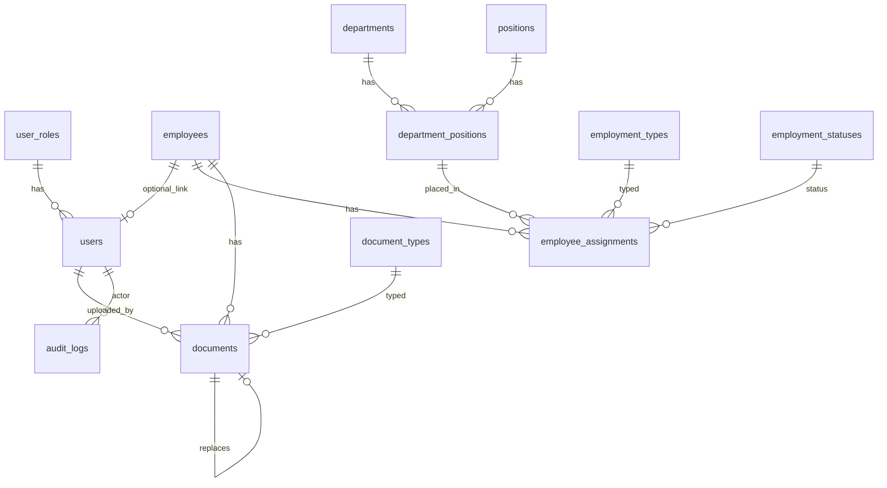

# Database schema

Source of truth: SQL migrations under [`db/migrations/`](../db/migrations/). Applied by [`server/src/db/migrate.js`](../server/src/db/migrate.js) into PostgreSQL. No ORM — routes use raw SQL via [`pg`](../server/src/db/pool.js).

## Migrations

| File | Purpose |
|------|---------|
| [`001_initial_schema.sql`](../db/migrations/001_initial_schema.sql) | Core tables, session store, audit |
| [`002_document_versioning.sql`](../db/migrations/002_document_versioning.sql) | `documents.version_number`, `replaces_id` |
| [`003_employee_no_nullable.sql`](../db/migrations/003_employee_no_nullable.sql) | `employees.employee_no` nullable (UNIQUE allows many NULLs) |

Tracking table: `schema_migrations (id TEXT PK, applied_at)`.

Seed: [`server/src/db/seed.js`](../server/src/db/seed.js) (roles, lookups, document types, sample org taxonomy, superadmin). Optional demo employees: `seed-employees.js`.

## Conventions

| Rule | Detail |
|------|--------|
| Primary keys | ULID as `CHAR(26)` |
| Timestamps | `TIMESTAMPTZ`, usually `created_at` / `updated_at` |
| Soft delete | `documents.deleted_at`; employees use `deleted_at` + `is_archived` |
| Usernames | `CITEXT` on `users.username` |
| Settings | `app_settings` key/`JSONB` value |
| File size | DB check `file_size <= 31457280` (30 MB) |

## Entity relationship



## Tables

### Lookups

**`departments`** — `id`, `name` (unique), `description`, `is_active`, timestamps.

**`positions`** — `id`, `name` (unique), `is_active`, timestamps.

**`department_positions`** — Junction used by assignments.

- Unique `(department_id, position_id)`
- Indexes on both FKs

**`employment_types`** / **`employment_statuses`** — Named lookups (`Full-time`, `Active`, etc. from seed).

**`document_types`** — 201 File catalog; `is_required` flags checklist items (PDS, TOR, NBI, …).

**`user_roles`** — `code` unique (`superadmin`, `admin`, `staff`, `viewer`).

### Core records

**`employees`**

| Column | Notes |
|--------|-------|
| `employee_no` | Optional UNIQUE (nullable after migration 003) |
| Name fields | `first_name`, `middle_name`, `last_name`, `name_extension` |
| `sex` | `male` \| `female` \| `other` \| NULL |
| `birth_date`, contact, `email`, `address` | |
| `profile_picture_path` | Relative path under FILES_ROOT |
| `is_archived`, `deleted_at` | Soft-delete / archive |
| `created_by`, `updated_by` | FK → `users` |

**`employee_assignments`**

- Links employee → `department_position` + employment type/status
- `start_date` / `end_date` with check `end_date >= start_date`
- Partial unique index: at most one **primary active** assignment per employee (`is_primary`, `is_active`, `end_date IS NULL`)

**`users`**

- `username` CITEXT unique, `password_hash` (bcrypt), `display_name`
- `role_id` → `user_roles`
- Optional `employee_id`
- `must_change_password`, `is_active`, `last_login`

**`documents`** (201 File)

| Column | Notes |
|--------|-------|
| `employee_id`, `document_type_id` | Required FKs |
| `file_name`, `stored_name`, `file_path` | Display vs disk |
| `file_size`, `mime_type` | Size capped at 30 MB in DB |
| `source` | `upload` \| `scan_folder` |
| `scan_inbox_filename` | When from scan |
| `version_number`, `replaces_id` | Version chain (migration 002) |
| `issued_date`, `expiry_date`, `remarks` | Optional |
| `uploaded_by`, `updated_by` | Users |
| `deleted_at` | Soft delete |

### System

**`app_settings`** — Keys used by the app include:

- `setup_completed` (boolean)
- `org_name`
- `files_root`
- `scan_inbox_path`
- `max_upload_bytes`

Env vars seed defaults before/during setup; setup wizard writes these. See [configuration.md](configuration.md).

**`audit_logs`** — `actor_user_id`, `action`, `entity_type`, `entity_id`, `meta` JSONB, `ip`, `created_at`.

**`session`** — `connect-pg-simple` store: `sid`, `sess` JSON, `expire`. Required for auth; do not drop while the app runs.

## Soft-delete semantics

```text
Active employees:  deleted_at IS NULL AND is_archived = FALSE
Archived list:     deleted_at IS NOT NULL  (GET /employees/trash)
Active documents:  deleted_at IS NULL
Trash documents:   deleted_at IS NOT NULL  (GET /documents/trash)
```

Permanent delete removes DB rows and corresponding files under `FILES_ROOT`.

## Indexes of note

- `idx_employees_name` on `(last_name, first_name)`
- Partial index on non-deleted, non-archived employees
- Document indexes for employee + type + version / recent uploads
- `audit_logs` by `created_at DESC` and `(entity_type, entity_id)`
- `IDX_session_expire` for session cleanup

## Applying schema

```bash
npm run db:create   # create database (optional helper)
npm run migrate     # apply pending migrations
npm run seed        # roles, lookups, superadmin
# or: npm run db:setup  # create + migrate + seed
```

Prerequisites and env: [development.md](development.md), [configuration.md](configuration.md).
