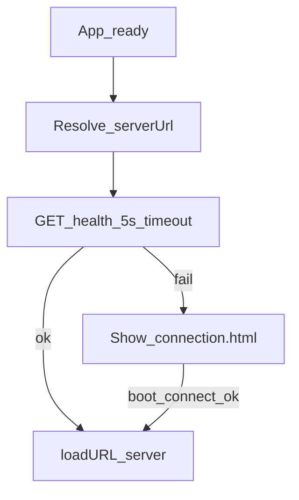

# Electron desktop client

Thin Windows (x64) shell that loads the registrar ERMS server UI. It does **not** run Express or talk to Postgres/files directly.

## Role in the system

```text
NSC-ERMS.exe  →  probe /api/v1/health  →  loadURL(https://erms.local:3443)
                                              ↓
                                    Same SPA + cookies as browser
```

Staff use the branded frameless window and Connect screen; business APIs remain HTTPS to the LAN server.

## Source layout

| Path | Purpose |
|------|---------|
| [`electron/main.js`](../electron/main.js) | Main process: window, probe, IPC, navigation lock |
| [`electron/preload.js`](../electron/preload.js) | Exposes `window.nscDesktop` |
| [`electron/connection.html`](../electron/connection.html) (+ `.js` / `.css`) | First-launch / unreachable Connect UI |
| [`electron/config.example.json`](../electron/config.example.json) | Sample `{ "serverUrl" }` |
| [`electron/assets/`](../electron/assets/) | App / installer icons |

Root [`package.json`](../package.json): `"main": "electron/main.js"`, electron-builder `appId` `ph.edu.nsc.erms`, product name `NSC-ERMS`.

## Server URL resolution

Order in `resolveServerUrl()`:

1. Environment `ERMS_SERVER_URL`
2. `config.json` — packaged: beside `NSC-ERMS.exe`; development: `electron/config.json`
3. Default: `https://localhost:3443`

URL is normalized to `protocol://host` (trailing slashes stripped). Only `http:` and `https:` allowed.

Successful Connect writes `{ "serverUrl": "…" }` to the config path.

## Boot flow



1. Create frameless `BrowserWindow` (~1280×800), custom titlebar via IPC.
2. Probe `GET {serverUrl}/api/v1/health` with `net.fetch` (5s abort).
3. On success → `loadURL(serverUrl)` and lock `allowedOrigin`.
4. On failure → load local Connect UI; user enters URL or host:port (± HTTP/HTTPS).

Second instance: `requestSingleInstanceLock` focuses the existing window.

## IPC bridge (`window.nscDesktop`)

Exposed from preload with `contextIsolation: true`, `nodeIntegration: false`, `sandbox: true`.

| API | Channel | Purpose |
|-----|---------|---------|
| `minimize()` | `window:minimize` | Minimize |
| `maximizeToggle()` | `window:maximize-toggle` | Maximize / restore |
| `close()` | `window:close` | Close |
| `isMaximized()` | `window:is-maximized` | Query |
| `onMaximizeChange(cb)` | `window:maximize-changed` | Event |
| `getBootState()` | `boot:get-state` | Connect UI state |
| `connect(serverUrl)` | `boot:connect` | Probe + save + load |
| `onBootReady(cb)` | `boot:ready` | Boot finished |
| `isDesktop` | — | `true` constant |

**Not** used for employees, documents, auth, or file IO. Those go through the loaded page’s `fetch` / SSE to the server origin.

SPA titlebar: [`renderer/src/js/components/titlebar.js`](../renderer/src/js/components/titlebar.js) calls `nscDesktop` when present.

## Security

- Navigation / new windows restricted to `allowedOrigin` (or `file://` for Connect UI).
- External links: `shell.openExternal`.
- Packaged build **excludes** a real `electron/config.json` from the asar pack (`!electron/config.json`); ships `config.example.json` as an extra file beside the exe.

## Develop

```bash
# API must be running
npm run dev:server
copy electron\config.example.json electron\config.json
# set serverUrl e.g. http://localhost:3443 if ALLOW_HTTP_DEV
npm run dev:desktop
```

## Package (Windows NSIS)

```bash
npm run build:desktop
```

Output: [`dist/desktop/`](../dist/desktop/) — installer + `win-unpacked/`.

Builder packages mostly `electron/**` + root `package.json` — **not** the Node server or renderer. UI updates are deployed on the registrar machine (`npm run build` + restart server); reinstall desktop when the Electron shell changes.

After install: copy `config.example.json` → `config.json` next to the exe, or use the Connect screen. Trust the LAN CA (e.g. mkcert) on staff PCs for HTTPS.

## Not implemented

- System tray
- Auto-update (`electron-updater`)
- macOS / Linux targets (Windows x64 NSIS only today)
- OS notifications
